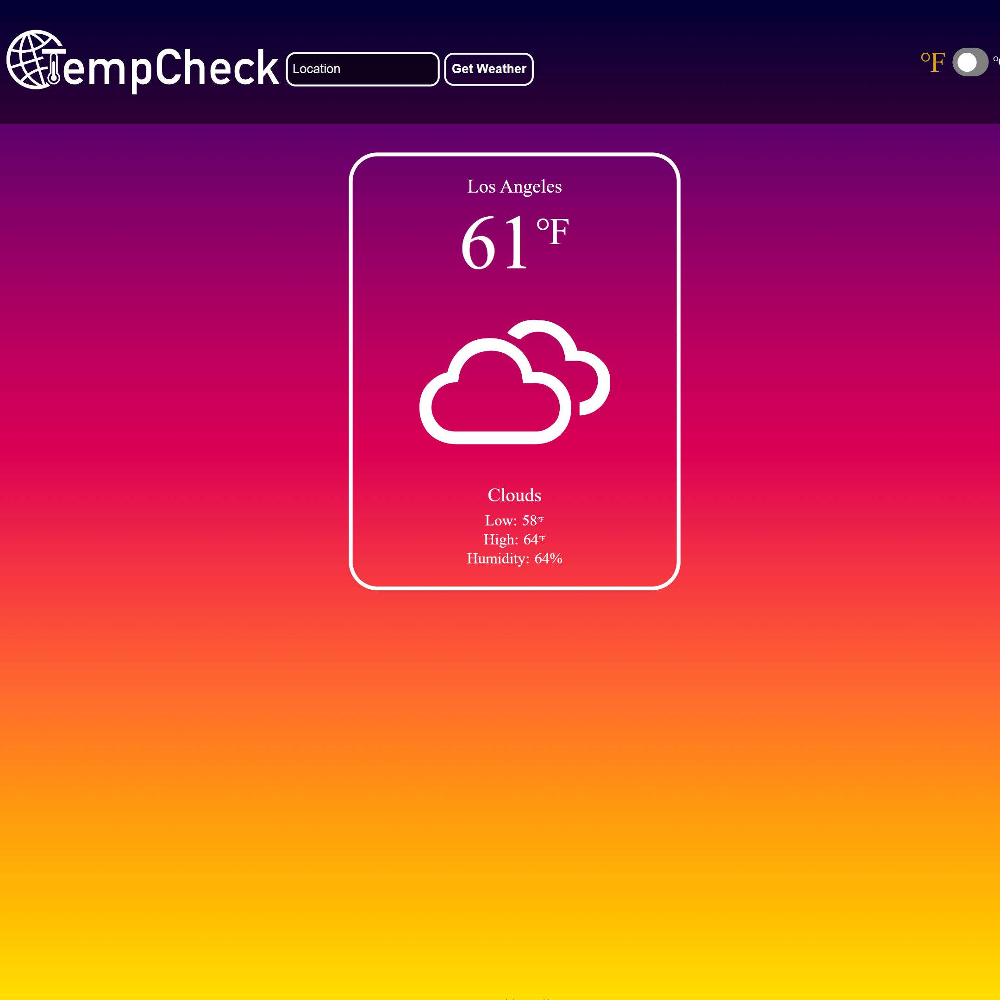

# Weather App

https://kihno.github.io/weather-app/

## Description

A simple weather app that connects to [Open Weather API](https://openweathermap.org/).

## Built With

- Webpack
- Async/await API

## Features

- Check the weather in any city in the world
- Toggle between fahrenheit and celsius

## Acknowledgements

Built as part of [The Odin Project](https://www.theodinproject.com/) full stack curriculm.